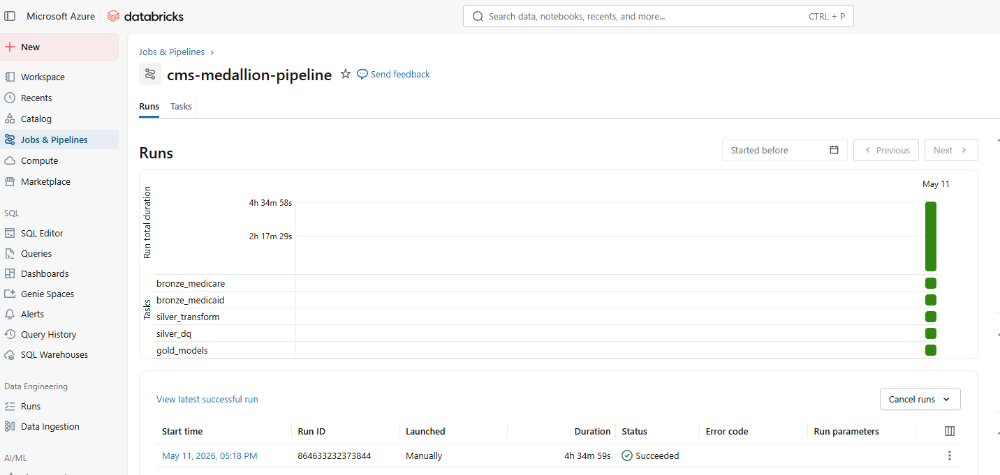

# CMS Medallion Pipeline

An end-to-end data engineering portfolio project on Azure Databricks using a Delta Lake medallion architecture. The pipeline ingests two public CMS healthcare datasets (Medicare and Medicaid), transforms them through bronze → silver → gold layers, and surfaces provider-level spending analytics and fraud risk indicators — all orchestrated with a Databricks Workflow and provisioned with Terraform.

## Architecture

```
CMS & HHS Open Data
        │
        ▼
┌───────────────────────────────────────────────────────────┐
│  Bronze Layer  (raw ingestion → ADLS Gen2 / Delta Lake)   │
│  • ingest_medicare    — CMS API, 9.66M rows, paginated    │
│  • ingest_medicaid    — HHS parquet, 238M rows, batch     │
└───────────────────────────┬───────────────────────────────┘
                            │
                            ▼
┌───────────────────────────────────────────────────────────┐
│  Silver Layer  (cleaned, typed, joined)                    │
│  • medicare          — renamed columns, cast types        │
│  • medicaid          — filtered to 2022, aggregated grain │
│  • provider_overlap  — inner join on NPI + HCPCS          │
└───────────────────────────┬───────────────────────────────┘
                            │
                            ▼
┌───────────────────────────────────────────────────────────┐
│  Gold Layer  (analytics-ready Delta tables via Spark SQL)  │
│  • agg_provider_spending     — Medicare + Medicaid join    │
│  • agg_specialty_utilization — HCPCS utilization by spec  │
│  • fraud_risk_indicators     — dual-billing risk scoring  │
└───────────────────────────────────────────────────────────┘
```

**Databricks Workflow — 5 tasks, sequential with fan-in at silver:**

```
bronze_medicare ─┐
                 ├──▶ silver_transform ──▶ silver_dq ──▶ gold_models
bronze_medicaid ─┘
```



For a deep dive into process flow, grain decisions, and dependency management, see [INTERNALS.md](INTERNALS.md).

## Stack

| Layer | Technology |
|---|---|
| Cloud platform | Azure (ADLS Gen2, Databricks Premium, Unity Catalog) |
| Storage format | Delta Lake |
| Compute | Databricks PySpark (Spark 15.4 / Scala 2.12) |
| Gold transforms | dbt-databricks (local dev), Spark SQL notebook (workflow) |
| Orchestration | Databricks Workflows (Jobs) |
| Infrastructure | Terraform (azurerm provider for Azure resources, databricks provider for cluster/workflow/Unity Catalog) |
| Auth | Managed identity via Databricks Access Connector |

## Data Sources

| Dataset | Source | Volume |
|---|---|---|
| Medicare Provider Utilization & Payment 2022 | [CMS Open Data API](https://data.cms.gov/provider-summary-by-type-of-service/medicare-physician-other-practitioners/medicare-physician-other-practitioners-by-provider-and-service) | 9,660,647 rows |
| Medicaid Provider Spending 2018–2024 | [HHS OpenData](https://opendata.hhs.gov/datasets/medicaid-provider-spending/) | 238,015,729 rows |

Both datasets are public (no API key required).

## Project Structure

```
cms-medallion-pipeline/
├── notebooks/
│   ├── bronze/
│   │   ├── ingest_medicare.py          # Paginated CMS API → Delta (batched)
│   │   └── ingest_medicaid_fraud.py    # HHS parquet → ADLS staging → Delta
│   ├── silver/
│   │   ├── transform_providers.py      # Clean, type, join → 3 silver tables
│   │   └── data_quality.py            # DQ checks (critical vs. non-critical)
│   └── gold/
│       ├── run_gold_models.py          # Spark SQL gold tables (workflow target)
│       └── run_dbt.py                  # dbt via Python API (reference only — not used by workflow)
├── dbt/
│   └── cms_medallion/
│       ├── dbt_project.yml
│       └── models/gold/
│           ├── sources.yml
│           ├── agg_provider_spending.sql
│           ├── agg_specialty_utilization.sql
│           └── fraud_risk_indicators.sql
├── .github/
│   └── workflows/
│       └── ci.yml                      # Terraform validate + dbt compile on every push
├── docs/
│   ├── workflow.png                    # Databricks Workflow DAG screenshot
│   ├── charge_gap_by_specialty.png     # Query result screenshot
│   ├── dual_billing_by_specialty.png   # Query result screenshot
│   ├── highest_risk_providers_1.png    # Query result screenshot
│   ├── highest_risk_providers_2.png    # Query result screenshot
│   ├── state_reimbursement_comparison.png # Query result screenshot
│   ├── top_hcpcs_high_risk.png         # Query result screenshot
│   └── commands.md                     # Chronological CLI steps used to build the project
├── queries/
│   ├── highest_risk_providers.sql      # risk_score = 3 dual billers ranked by charge ratio
│   ├── charge_gap_by_specialty.sql     # specialties with largest charge-to-payment gap
│   ├── dual_billing_by_specialty.sql   # dual-billing participation rate by specialty
│   ├── state_reimbursement_comparison.sql # Medicare payment variation by state
│   └── top_hcpcs_high_risk.sql        # procedures most common among high-risk providers
└── terraform/
    ├── main.tf                         # All Azure + Databricks resources
    ├── variables.tf
    ├── outputs.tf
    └── terraform.tfvars.example
```

## Query Results

| Query | Screenshot |
|---|---|
| Highest risk dual-billing providers | [view](docs/highest_risk_providers_1.png) · [view 2](docs/highest_risk_providers_2.png) |
| Charge-to-payment gap by specialty | [view](docs/charge_gap_by_specialty.png) |
| Dual-billing participation by specialty | [view](docs/dual_billing_by_specialty.png) |
| Medicare reimbursement by state | [view](docs/state_reimbursement_comparison.png) |
| Top HCPCS codes among high-risk providers | [view](docs/top_hcpcs_high_risk.png) |

## Gold Layer Tables

### `agg_provider_spending`
Provider-level rollup: all Medicare providers left-joined to Medicaid. Key columns: `medicare_avg_payment_amt`, `medicaid_total_paid`, `bills_both_programs` flag (true when the provider appears in both programs).

### `agg_specialty_utilization`
Specialty + HCPCS (Healthcare Common Procedure Coding System — standardized billing codes for medical services) aggregation from Medicare silver. Includes `avg_charge_to_payment_gap` (submitted charge minus Medicare reimbursement).

### `fraud_risk_indicators`
Targets dual-billing providers (appear in both programs). Computes specialty benchmarks (avg, p95 services, stddev charges) and assigns a composite `risk_score` (0–3) based on:
- `high_volume_flag` — services > p95 for specialty/HCPCS
- `high_charge_flag` — submitted charge > 2× specialty average
- `high_medicaid_spend_flag` — Medicaid paid > $50,000

## Key Design Decisions

**Batch writes for bronze ingestion** — The Medicare API returns 9.66M rows via pagination. Writing each 5,000-row page directly to Delta (overwrite first, append thereafter) avoids accumulating the full dataset in driver memory. The Medicaid parquet (238M rows) is copied directly to ADLS staging via `dbutils.fs.cp` before Spark reads it, bypassing the `/tmp` restriction in Unity Catalog.

**Silver grain normalization** — Raw Medicare has one row per provider/HCPCS/place-of-service; `silver/medicare` preserves that raw grain with renamed columns and cast types. The aggregation to provider/HCPCS grain happens when building `silver/provider_overlap` for joining: all billing measures (`total_services`, `total_beneficiaries`, payment amounts) are summed or averaged across locations so no activity is lost, and provider metadata (`specialty`, `state`) uses `first()` to pick one representative value rather than exploding rows. Raw Medicaid has one row per billing provider/servicing provider/HCPCS/month; `silver/medicaid` aggregates to billing provider/HCPCS/month, summing totals across all servicing providers.

**Unity Catalog auth via managed identity** — ADLS Gen2 access uses a Databricks Access Connector (system-assigned managed identity) with `Storage Blob Data Contributor` role, avoiding storage account keys entirely.

**Idempotent pipeline tasks** — every task can be safely re-run after a failure without manual cleanup. Medicare ingestion overwrites on the first batch and appends deterministically; Medicaid, silver, and gold all use overwrite or `CREATE OR REPLACE TABLE` semantics.

**dbt for local development, Spark SQL for the workflow** — dbt-databricks runs cleanly from a local venv for iterative SQL development. In-notebook `%pip install dbt-databricks` conflicts with Databricks' internal protobuf version — installing dbt-databricks at runtime upgrades protobuf to a newer incompatible version, breaking Databricks' own internal libraries that depend on the older version. The workflow task instead runs the same SQL directly via `spark.sql()`.

## Approximate Cost

Based on a single full pipeline run (~4.5 hours) on Azure East US:

| Resource | Estimated Cost |
|---|---|
| Databricks cluster (Standard_D4s_v3, ~4.5 hrs) | ~$3.00 |
| ADLS Gen2 storage (~50 GB data + transactions) | ~$1.50 |
| Databricks workspace (Premium SKU, idle) | ~$0.00 |
| **Total per run** | **~$4.50** |

Costs are approximate and vary by region and Azure pricing tier. The cluster auto-terminates after 30 minutes of inactivity so leaving it idle between runs incurs no compute cost.

## Setup

### Prerequisites
- Azure CLI authenticated (`az login`)
- Terraform ≥ 1.5
- Azure subscription with Databricks Premium available

### 1. Provision infrastructure

```bash
cd terraform
cp terraform.tfvars.example terraform.tfvars
# Fill in subscription_id and databricks_pat
terraform init
terraform apply
```

### 2. Upload notebooks to Databricks workspace

Import the five notebooks from `notebooks/` into your Databricks workspace, maintaining the `bronze/`, `silver/`, `gold/` folder structure under your user directory.

### 3. Run the workflow

The `cms-medallion-pipeline` job is created by Terraform. Trigger it from the Databricks Jobs UI or:

```bash
databricks jobs run-now --job-id <JOB_ID>
```

Full pipeline runtime: ~4.5 hours (dominated by Medicare API pagination and Medicaid parquet ingest).

### Local dbt development

```bash
cd dbt/cms_medallion
python -m venv ../.venv && source ../.venv/bin/activate
pip install dbt-databricks
# configure ~/.dbt/profiles.yml with your warehouse http_path and PAT
dbt run
```
